# Mobile QA Appium Showcase

Appium test automation for the [My Demo App (Android)](https://github.com/saucelabs/my-demo-app-android),
Sauce Labs' open-source demo shopping app. Take-home showcase of how I'd structure and approach
mobile test automation for a real project.

## Bugs found while testing

I found 4 real bugs while testing, on top of 2 the app's own source already marks as intentional.

- Tapping most catalog items crashes the app. 19 of 24 products, not just an edge case (TC7).
- Adding "Sauce Labs Bolt T-Shirt" to the cart always sets quantity 10 (TC6).
- Removing a cart item freezes the UI for several seconds (TC8).
- "Test.allTheThings() T-Shirt" shows 5 identical color swatches instead of 1 (TC9).

Details below, each with a screenshot.

## Approach

Kotlin, JUnit 5, and the Appium Java client, as a plain JVM Gradle project, not an Android Gradle
Plugin project. Appium talks to a remote server, not the device itself, so I only needed the APK
and a running device, not the app's own source set up locally to run the tests.

For structure I used Page Object Model: one class per screen, in `src/main/kotlin/.../pages`. If
a locator changes, I fix it in one place instead of in every test that uses it. `BasePage` wraps
every lookup in an explicit `WebDriverWait`, no `Thread.sleep` anywhere in the suite. Each test
also gets its own driver session (`AppiumTestBase`), so one test can't leave state behind for the
next one, like a leftover cart item.

I pulled locators and error text from the app's own source instead of guessing them off the
running UI, so the tests use exact resource IDs and exact copy. That's also how I found the app
opens on the Product Catalog, not login: `MainActivity.init()` defaults to
`FRAGMENT_PRODUCT_CATALOG`. Login is only reachable through the side drawer's "Log In" row.

## Test scenarios

I chose login and add-to-cart to plan the scenarios. Each covers a happy path, a negative case,
and state that persists across screens. Testing the running app, not just its source, also
surfaced 4 real defects (6 to 9 below).

For automation I picked add-to-cart (scenario 4) and the quantity bug (scenario 6) instead of
login. Login is the first thing every other candidate will automate. A real bug I found myself
says more about how I test.

| # | Scenario | Type | Automated |
|---|----------|------|-----------|
| 1 | Valid credentials (`bod@example.com` / `10203040`) log the user in and land on the product catalog | Positive | Manual |
| 2 | The seeded locked-out account (`alice@example.com`) is rejected with the app's own lockout copy, not a generic error | Negative | Manual |
| 3 | Submitting the login form with an empty username shows the inline "Username is required" validation and does not navigate away | Negative / validation | Manual |
| 4 | Adding a product to the cart makes the (previously hidden) cart badge appear in the header with count `1` | Positive | ✅ `CartTests.addingProductToCartUpdatesHeaderBadge` |
| 5 | Sorting the catalog by price ascending actually re-orders the list | Positive / functional | Manual |
| 6 | Adding "Sauce Labs Bolt T-Shirt" to the cart always sets quantity 10, ignoring the quantity stepper | Regression (bug) | ✅ `QuantityBugTests.addingBoltTShirtAppliesSeededQuantityBug` |
| 7 | Tapping most catalog items (19 of 24 products, see below) crashes the app | Regression (crash) | Manual |
| 8 | Removing an item from the cart freezes the UI for several seconds | Regression (performance) | Manual |
| 9 | "Test.allTheThings() T-Shirt" shows 5 identical color swatches instead of 1 | Regression (bug) | Manual |

2 are automated. That's enough to satisfy "automate at least one testcase," not more than I can
walk through myself. The other 7 are documented step by step below, each with screenshots. 4 of
those 7 (6 to 9) are real bugs in the app.

### Step-by-step test cases

Precondition unless stated otherwise: app freshly launched, lands on the Product Catalog.

**TC1: Valid login** *(not automated)*

| Step | Action | Screenshot |
|---|---|---|
| 1 | Tap the menu icon in the header |  |
| 2 | Tap "Log In" |  |
| 3 | Tap the `bod@example.com` demo credential (auto-fills username + password `10203040`) | 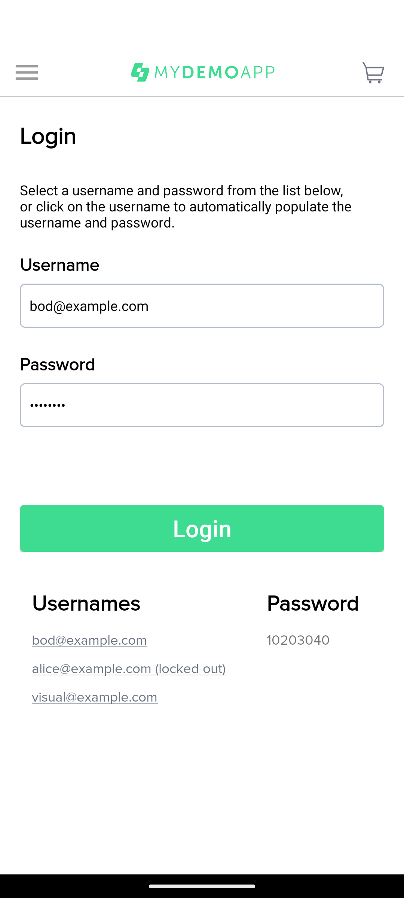 |
| 4 | Tap "LOGIN" |  |

Expected: back on the Product Catalog screen (step 4), no error shown.

**TC2: Locked-out account** *(not automated)*

| Step | Action | Screenshot |
|---|---|---|
| 1 | Tap the menu icon in the header |  |
| 2 | Tap "Log In" | 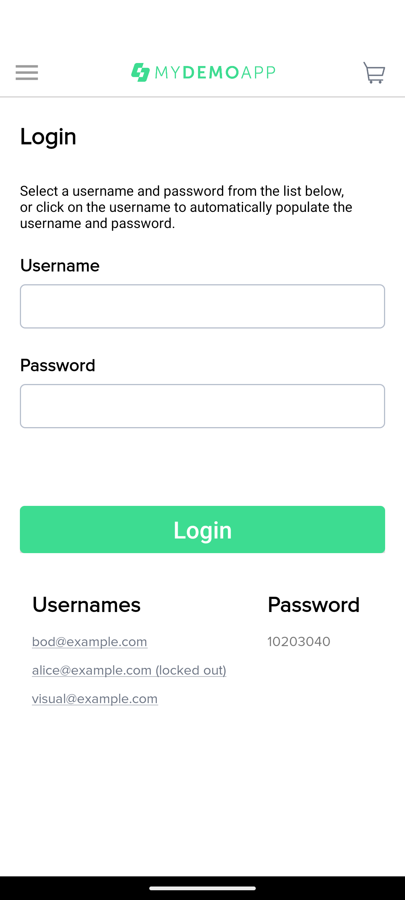 |
| 3 | Tap the `alice@example.com (locked out)` demo credential | 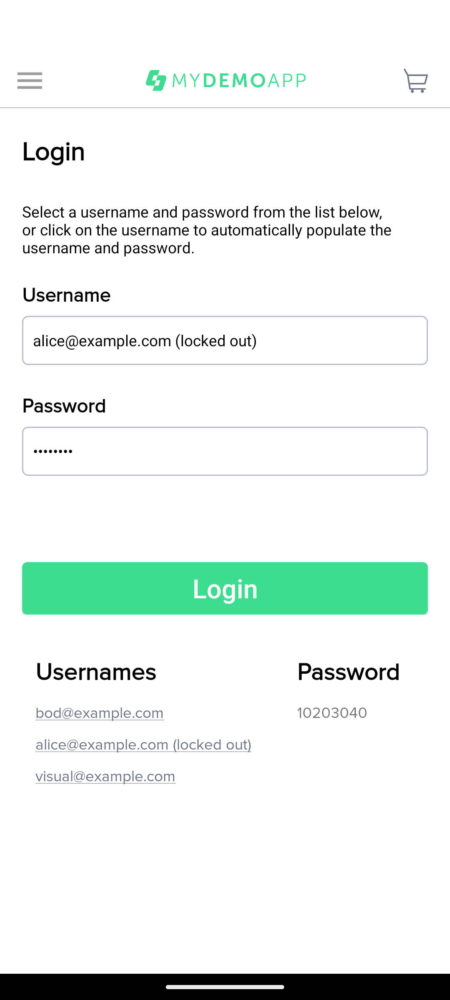 |
| 4 | Tap "LOGIN" | 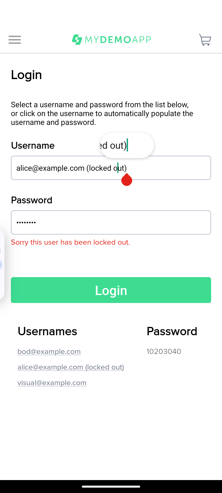 |

Expected: inline error "Sorry this user has been locked out." under the password field (step 4).
Stays on the Login screen.

**TC3: Empty username validation** *(not automated)*

| Step | Action | Screenshot |
|---|---|---|
| 1 | Tap the menu icon in the header | 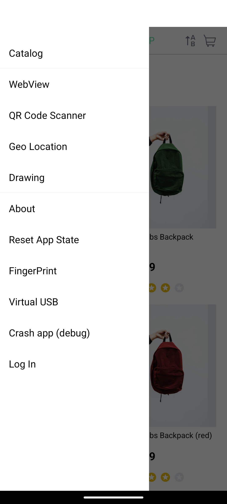 |
| 2 | Tap "Log In" |  |
| 3 | Leave the username field empty, enter a password | 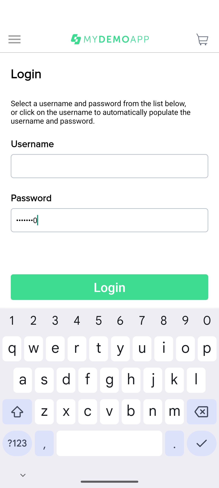 |
| 4 | Tap "LOGIN" | 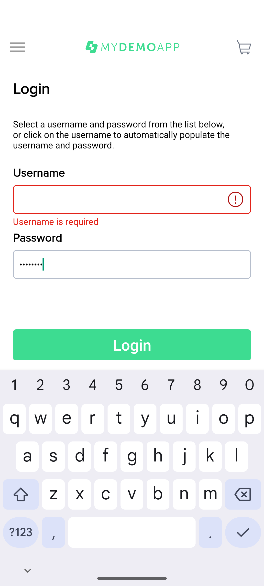 |

Expected: inline "Username is required" error shown (step 4). Stays on the Login screen.

**TC4: Add to cart updates the header badge** *(automated: `CartTests.addingProductToCartUpdatesHeaderBadge`)*

| Step | Action | Screenshot |
|---|---|---|
| 1 | On the Product Catalog, confirm no cart badge is shown | 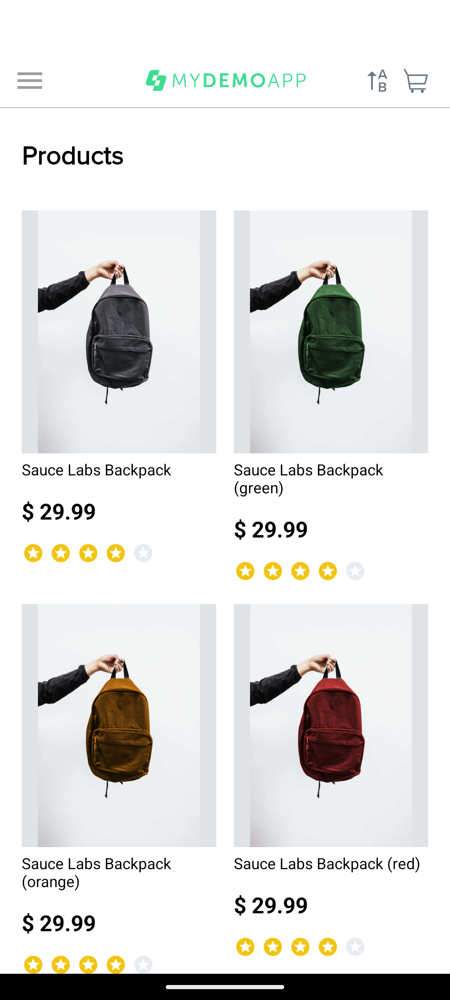 |
| 2 | Tap the first product ("Sauce Labs Backpack") | 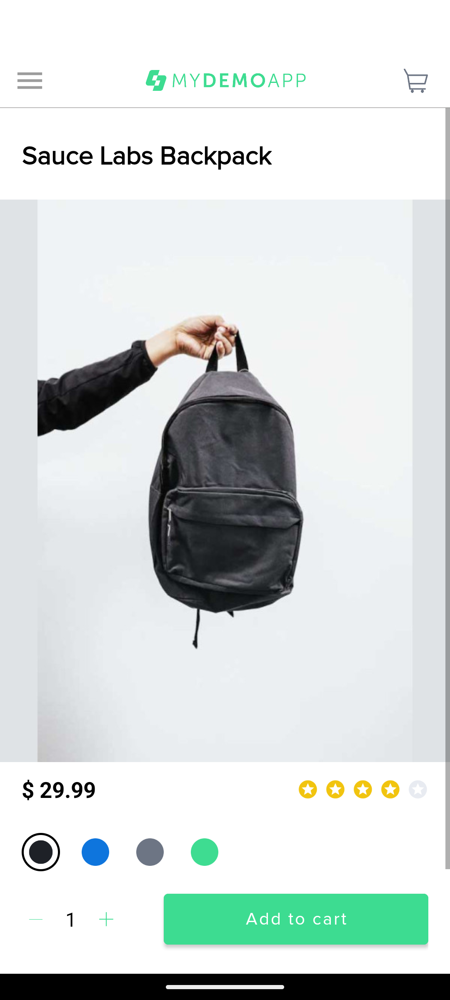 |
| 3 | On the Product Detail screen, tap "ADD TO CART" | 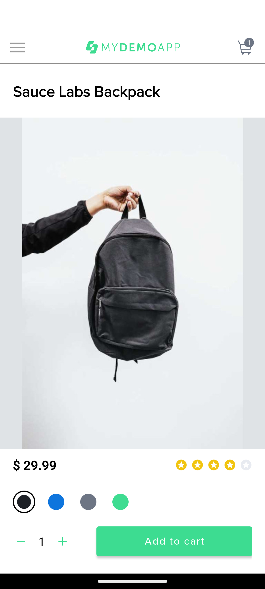 |

Expected: the app stays on the Product Detail screen (step 3). Tapping "Add to cart" doesn't
navigate anywhere. The cart badge shows `1` in the header, which is part of the shared layout
(`activity_main.xml`) visible on every screen, not just the catalog.

**TC5: Sort by price** *(not automated)*

| Step | Action | Screenshot |
|---|---|---|
| 1 | On the Product Catalog, tap the sort icon in the header | 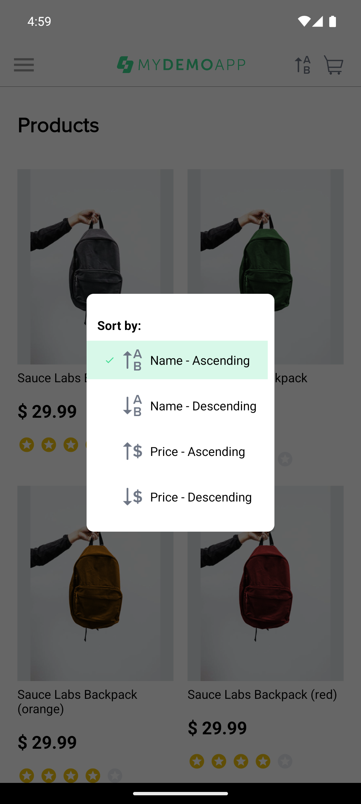 |
| 2 | Select "Price - Ascending" |  |

Expected: list re-orders so the lowest-priced item ("Sauce Labs Onesie", $7.99) is first (step 2).

**TC6: Seeded quantity bug repro** *(automated: `QuantityBugTests.addingBoltTShirtAppliesSeededQuantityBug`)*

| Step | Action | Screenshot |
|---|---|---|
| 1 | Sort the catalog by "Price - Ascending" first. Tapping "Sauce Labs Bolt T-Shirt" directly from the default alphabetical view crashes the app (see TC7) |  |
| 2 | Open "Sauce Labs Bolt T-Shirt" (now safely reachable at its sorted position), leave the quantity stepper at its default `1` |  |
| 3 | Tap "ADD TO CART" | 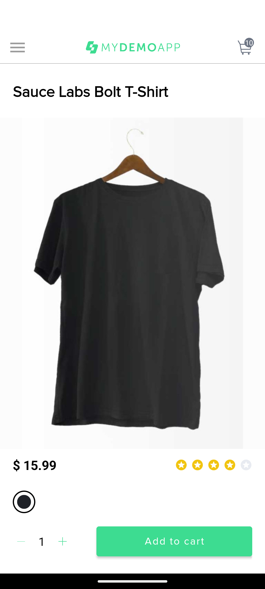 |

Expected (bug): the header badge shows `10`, not `1` (step 3).

**TC7: Catalog tap crashes the app for out-of-range products** *(not automated)*

Precondition: catalog in default (alphabetical) sort, a fresh launch or after `pm clear`. Sort
order persists across screens until the app is killed, so if it's already sorted differently
(say from TC5 or TC6), "Bolt T-Shirt" lands on a different, safe position and won't crash. Same
bug, different position. Not flakiness.

| Step | Action | Screenshot |
|---|---|---|
| 1 | From the default (alphabetical) Product Catalog, scroll down until "Sauce Labs Bolt T-Shirt" is visible (8th item, adapter position 7 in that ordering) | 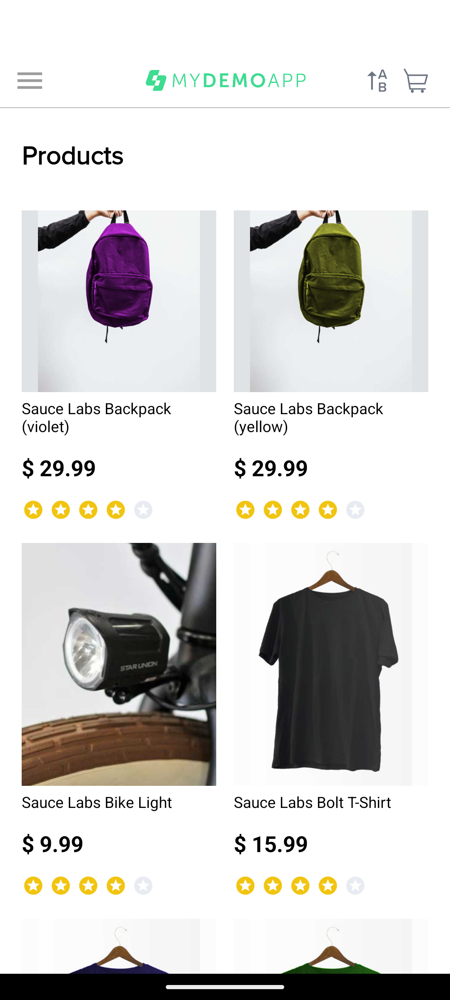 |
| 2 | Tap it | 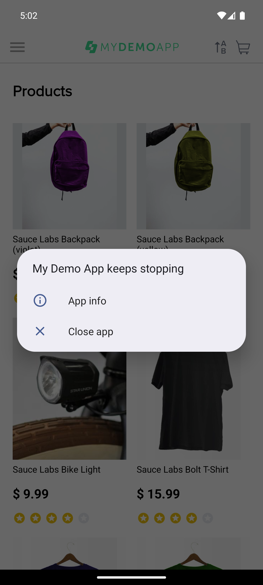 |

Expected (bug, reproduced five times): the app crashes. "My Demo App keeps stopping" (step 2). I
traced the root cause to `ProductCatalogFragment.setAdapter()`: catalog taps are mapped through a
hardcoded 6-element array, `Integer[] meta = {0, null, 2, 3, 4, 5}` (the source comment even says
`null is an intentionally introduced bug for demos`), used as `meta[position].intValue()`. A tap
on position 6 or higher throws `ArrayIndexOutOfBoundsException` (position 7 here, confirmed in
logcat every time). A tap on position 1 throws `NullPointerException`.

Scope: 24 products total, confirmed by scrolling to the end of the list. Only 5 are safe to tap
(positions 0, 2, 3, 4, 5, the "Sauce Labs Backpack" family). The other 19 (79%) crash. That's most
of the catalog, not an edge case.

**TC8: Removing a cart item freezes the UI** *(not automated)*

| Step | Action | Screenshot |
|---|---|---|
| 1 | Add any product to the cart, then open the cart (tap the cart icon in the header) | 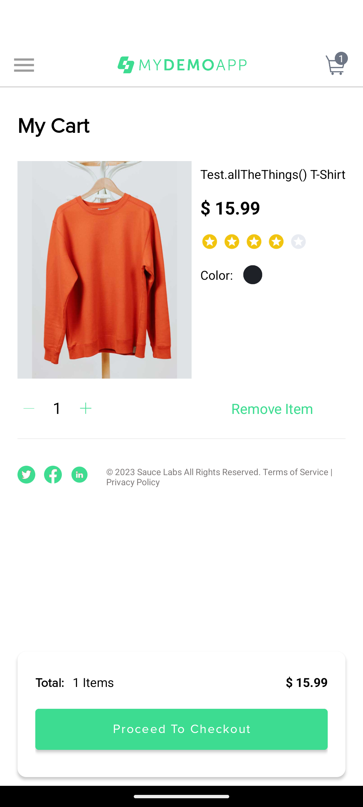 |
| 2 | Tap "Remove Item" | 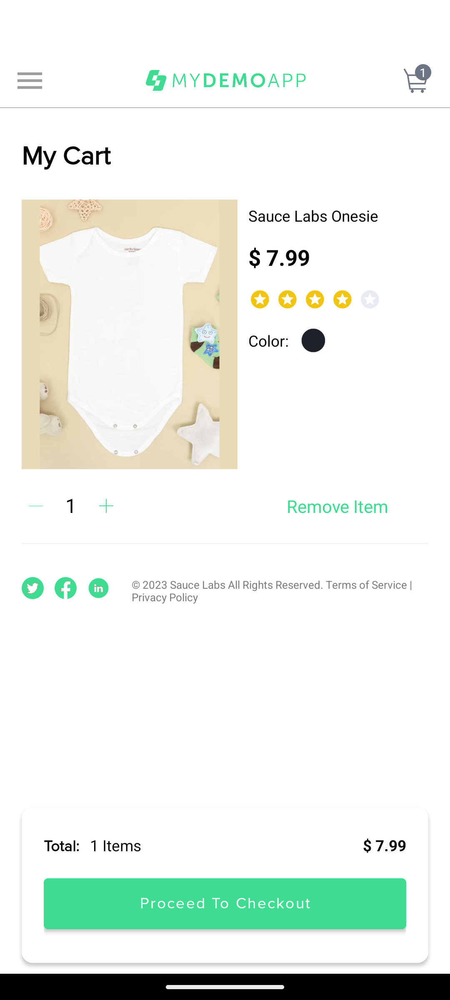 |
| 3 | Wait |  |

Expected (bug): the item is eventually removed (step 3), but the UI freezes for several seconds
first. Step 2's screenshot, taken under a second after the tap, still shows the old state. I
traced it to `CartItemAdapter`'s `removeBt` listener, a busy-wait on the UI thread:
```java
long end = System.currentTimeMillis() + 5000;
while (System.currentTimeMillis() < end) {
    // try again and again!
}
```
The source comment above it claims "2 seconds." The code actually blocks for 5.

**TC9: Shared color list shows the wrong swatches** *(not automated)*

| Step | Action | Screenshot |
|---|---|---|
| 1 | Sort the catalog by price (see TC5) so "Test.allTheThings() T-Shirt" is reachable without hitting TC7 | 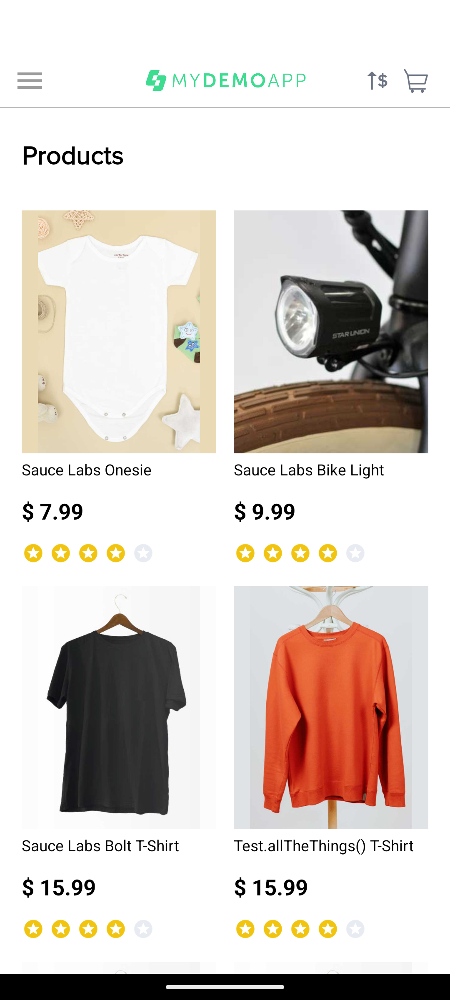 |
| 2 | Open it | 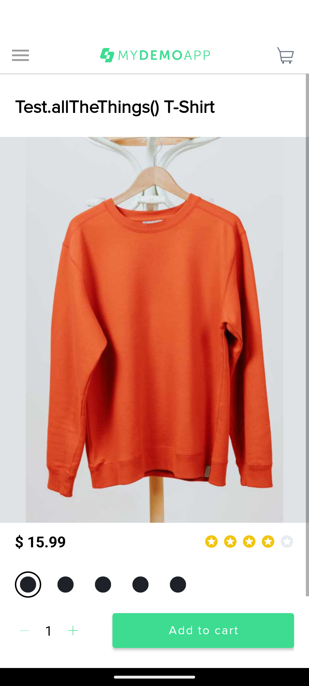 |

Expected (bug): this product has 1 color (black) in the source, but the detail screen (step 2)
shows 5 identical swatches. I traced it to the code that builds the product list: the loop right
after this product, which generates the "Bolt T-Shirt" color variants, forgets to start a new
color list for each one, unlike every other similar loop in the file. It just keeps adding to the
same list object, so every product built after that point ends up showing all of it. Picking one
of the duplicate swatches would also add the wrong color to the cart.

## Prerequisites

- JDK 17+
- [Appium](https://appium.io/) 2.x/3.x with the UiAutomator2 driver:
  ```
  npm install -g appium
  appium driver install uiautomator2
  ```
- Android SDK platform-tools, emulator, and a system image, with a running AVD or a connected
  physical device. `ANDROID_HOME` must point at the SDK root.
- The app under test. Download the APK from the upstream project's
  [releases page](https://github.com/saucelabs/my-demo-app-android/releases). This suite was
  written against `2.2.0` / `mda-2.2.0-25.apk`. Place it at `apks/mda-2.2.0-25.apk`, or pass a
  different path with `-Dapp.path=...` (see below).

## Running it

```bash
# 1. Start an emulator (or connect a device) and confirm it's visible:
adb devices

# 2. Start the Appium server:
appium

# 3. Run the suite:
./gradlew test
```

Two things differ between machines: where Appium runs, and where the APK is. Both are plain
system properties.

| Property | Default | Purpose |
|---|---|---|
| `-Dappium.serverUrl` | `http://127.0.0.1:4723` | Appium server endpoint |
| `-Dapp.path` | `apks/mda-2.2.0-25.apk` | Path to the APK under test |

Everything else (device name, app package/activity) is a fixed default for the standard local
setup: one emulator or device running as `emulator-5554`.

## Verification status

Run against a booted emulator (Pixel 6 profile, Android 16 / API 36, `google_apis_playstore`
arm64-v8a image) with a local Appium server and the UiAutomator2 driver. Both tests pass.

```
> Task :test

CartTests > Adding a product to the cart shows a badge with count 1 PASSED

QuantityBugTests > Adding Sauce Labs Bolt T-Shirt to the cart sets quantity to 10, not 1 PASSED

BUILD SUCCESSFUL in 46s
4 actionable tasks: 2 executed, 2 up-to-date
```
